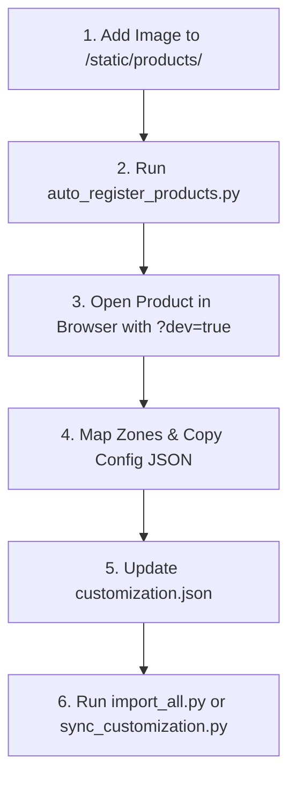

# **Soham Gift - Corporate Gifting Platform**

Soham Gift is a **premium, full-stack B2B corporate gifting e-commerce platform** designed to bridge the gap between browsing a product catalog and visualizing custom brand/logo placements on products in real-time. It provides a pixel-perfect, highly aesthetic frontend customizer, a robust Django backend, and multiple admin layers for seamless bulk order and catalog management.

---

## 🎨 **Core Features**

### **1. Advanced Branding Engine (Live Customizer)**
The crown jewel of the platform, powered by a customized **Fabric.js** implementation:
*   **Real-Time Rendering:** Instant visualization of custom logos and text on product mockups.
*   **Curved Text Support:** Dynamic path wrapping for cylindrical surfaces (e.g., Water Bottles, Mugs).
*   **Intelligent Auto-Fit:** Automatic font resizing and character spacing to prevent custom text from overflowing zone boundaries.
*   **Developer Mapping Mode:** Interactive coordinate picking tool accessible via `?dev=true` or `?dev=1` on any customizable product page.
*   **High-Resolution Mockups:** Generates 2x resolution PNGs for quote submissions.

### **2. B2B & E-Commerce Workflow**
*   **Bulk Order Engine:** Corporate clients can submit high-volume requests with their uploaded logo and live customization mockups attached.
*   **Direct Orders:** Fully integrated cart and checkout workflow backed by **Razorpay** integration.
*   **Dual Admin System:** Manage operations using either the modern **React Dashboard** or the secure **Django Admin**.
*   **Responsive & Smooth UI:** Responsive design built with React, styled using Tailwind CSS, and animated with Framer Motion.

---

## 🛠️ **Technology Stack**

| Layer | Technologies Used |
| :--- | :--- |
| **Frontend** | React 19, Vite, Tailwind CSS, Fabric.js, Framer Motion, Axios |
| **Backend** | Django 4.2+, Django REST Framework, SQLite (Dev/Prod fallback), Pillow, django-simple-history |
| **Design** | Lucide React Icons, Google Fonts (Outfit, Inter) |
| **Payments** | Razorpay SDK (Standard Checkout) |

---

## 🚀 **Getting Started & Run Commands**

Ensure you have **Python 3.10+** and **Node.js 18+** installed on your system.

### **1. Backend (Django REST API) Setup**

```bash
# Navigate to the backend directory
cd backend

# Create a virtual environment
python -m venv venv

# Activate the virtual environment
# On Windows (PowerShell):
venv\Scripts\Activate.ps1
# On Windows (Command Prompt):
venv\Scripts\activate.bat
# On macOS/Linux:
source venv/bin/activate

# Install dependencies
pip install -r requirements.txt

# Apply database migrations
python manage.py migrate

# Seed administrative accounts and default category metadata
# (Creates default superuser account: username 'admin' and password 'admin123')
python seed_data.py

# Seed default corporate catalog products
python seed_products.py

# Start the Django development server
python manage.py runserver
```

The Django server will start running on **`http://127.0.0.1:8000/`**.

### **2. Frontend (React + Vite) Setup**

```bash
# Navigate to the frontend directory
cd frontend

# Install Node modules
npm install

# Start the Vite development server
npm run dev
```

The React frontend will be accessible at **`http://localhost:5173/`**.

---

## 📦 **Product Management Workflows**

To ensure high reliability, the platform utilizes a **hybrid sync pipeline**: product information is stored in the database, while the Fabric.js interactive canvas boundaries are configured via a static configuration file (`customization.json`) which acts as the coordinate master template.

---

### 🟢 **Workflow A: Adding/Uploading a Product (Automatic CLI Flow)**

This is the recommended developer flow for importing new physical product lines into the customizer.



#### **Step 1: Save Image Assets**
1.  Save the clean, high-resolution product mockup base image into the backend assets folder:  
    `backend/static/products/`
2.  Duplicate/mirror the image into the frontend static assets directory to ensure build integrity:  
    `frontend/public/static/products/`
3.  **Strict Image Naming Standard:** Always name images using `lowercase_with_underscores.png` (e.g., `silver_executive_pen.png`).

#### **Step 2: Auto-Register Image Assets**
Run the automated CLI scanner from the backend:
```bash
cd backend
python auto_register_products.py
```
*   **What this does:** Scans the static directory, detects new images that aren't registered, generates unique `productIds`/`slugs`, creates default zones (1 Text, 1 Logo), and appends them to `frontend/src/data/customization.json`.

#### **Step 3: Graphically Map Branding Zones**
1.  Launch both backend and frontend servers.
2.  Open your browser and navigate to the newly added product detail page. Add `?dev=true` to the URL.
3.  The product customization canvas will render in **Developer Mapping Mode**.
4.  Drag, position, and scale the text/logo bounding boxes over the customizable print area of the product image.
5.  Click the **"Copy Config JSON"** button to copy the updated coordinate zones data to your clipboard.

#### **Step 4: Update Source JSON**
1.  Open `frontend/src/data/customization.json`.
2.  Locate the entry matching your new product's `productId` or `slug`.
3.  Replace its `"zones"` list with the JSON payload you copied from the interactive browser customization tool.

#### **Step 5: Sync Database**
Push the configurations to the active database:
```bash
# To create any missing database product listings:
python import_all.py

# To update existing database listings with your new zone configurations:
python sync_customization.py
```

---

### 🔵 **Workflow B: Adding/Uploading a Product (Django Admin Flow)**

Admin users can manage the catalog directly using the web portal.

1.  Log in to the Django Admin panel: **`http://127.0.0.1:8000/admin/`** (admin / admin123).
2.  Under the **Products** application section, click **Add Product**.
3.  Provide the descriptive metadata:
    *   **Name:** e.g., `Premium Matte Mug`
    *   **Slug:** `premium-matte-mug` (will auto-generate if left blank)
    *   **Price:** e.g., `599.00`
    *   **Category:** Select from the dropdown list.
    *   **Image:** E.g., `/static/products/matte_mug.png`
4.  Paste the Fabric.js configuration zones list inside the **Customization config** text field in raw JSON format:
    ```json
    [
      {
        "id": "text-1",
        "type": "text",
        "x": 500,
        "y": 450,
        "maxWidth": 300,
        "maxChars": 15,
        "fontSize": 32,
        "fill": "#ffffff"
      }
    ]
    ```
5.  Click **Save**.

---

### 🔴 **Workflow C: Deleting/Deactivating a Product**

To safeguard order history and inquiry trails, this project enforces **Soft Deletions**. Soft-deleted products are hidden from the frontend catalog but remain preserved in database history.

#### **Method 1: Django Admin Panel (Recommended)**
1.  Navigate to **`http://127.0.0.1:8000/admin/products/product/`**.
2.  Click on the product you wish to hide.
3.  Scroll to the flags section and tick the **Is deleted** checkbox.
4.  Click **Save**.

#### **Method 2: Django Interactive Shell (CLI)**
To soft delete a product via script or terminal command:
```bash
cd backend
python manage.py shell
```
Execute the following Python commands:
```python
from products.models import Product

# Locate the product using its unique slug
product = Product.objects.get(slug="executive-trio-sr-125")

# Trigger the built-in soft deletion method
product.soft_delete()

print(f"Product '{product.name}' has been soft deleted.")
```
> [!NOTE]
> If you need to permanently purge a product from the database, run:
> `product.delete()` inside the shell.

---

## 🛠️ **Management & Maintenance Scripts Catalog**

The backend is equipped with utility scripts to facilitate quick administration and clean-up tasks:

| Command | File Path | Detailed Description |
| :--- | :--- | :--- |
| `python seed_data.py` | `backend/seed_data.py` | Sets up default admin profiles, global corporate site settings, and Category groups. |
| `python seed_products.py` | `backend/seed_products.py` | Seeds the standard mock catalog using assets and preset customization parameters. |
| `python auto_register_products.py` | `backend/auto_register_products.py` | Scans the static directory for unmapped images, registers them to `customization.json` with standard fallback nodes, and assigns them a category. |
| `python import_all.py` | `backend/import_all.py` | Core importer tool that translates and populates all items within `customization.json` directly into Django DB records. |
| `python sync_customization.py` | `backend/sync_customization.py` | Syncer utility that pushes localized updates inside `customization.json` into the corresponding DB products. |
| `python clean_names.py` | `backend/clean_names.py` | Mass sanitization script that converts all files inside static product directories to comply with standard lowercase/underscore naming rules. |
| `python fix_media_names.py` | `backend/fix_media_names.py` | Aligns file naming structures across user-uploaded items and database file paths. |
| `python update_to_static.py` | `backend/update_to_static.py` | Re-links legacy product database paths targeting old media folders to point directly to clean, compiled static directories. |
| `python fix_categories.py` | `backend/fix_categories.py` | Automated audit tool designed to correct category misalignments or duplicates in the database. |
| `python fix_json_product_ids.py` | `backend/fix_json_product_ids.py` | Resolves index overlaps or ID integrity errors inside the `customization.json` document. |
| `python patch_zones.py` | `backend/patch_zones.py` | Performs batch edits (like scaling or offsets) on coordinates across customization configurations. |
| `python audit_products.py` | `backend/audit_products.py` | Scans database products to audit description lengths, image existences, and pricing configurations. |
| `python audit_sync.py` | `backend/audit_sync.py` | Detailed comparison tool checking if DB values perfectly mirror configuration templates. |

---

## 📡 **Central API Reference**

All endpoints require standard JSON payloads and return JSON responses. Actions modifying database records require standard token authentication.

| Route | Method | Access | Description |
| :--- | :--- | :--- | :--- |
| `/api/products/` | `GET` | Public | Lists all active, non-deleted products. Supports query filters: `?category=`, `?search=`, `?is_trending=`, `?min_price=`, `?max_price=`, and sorting via `?ordering=`. |
| `/api/products/suggestions/` | `GET` | Public | Returns autocomplete text matches for products, categories, and brands matching query parameter `?q=`. |
| `/api/products/<id>/related/` | `GET` | Public | Pulls up to 4 popular products belonging to the same category. |
| `/api/categories/` | `GET` | Public | Retrieves all active catalog categories alongside their product counts. |
| `/api/bulk-order/` | `POST` | Public | Submits a B2B corporate quote inquiry. Supports multipart form data for uploading corporate logos and mockup images. |
| `/api/auth/login/` | `POST` | Public | Accepts user credentials and returns a JWT access/refresh token pair. |
| `/api/orders/create-order/` | `POST` | Authenticated | Places an order, establishing cart items and generating a Razorpay signature. |
| `/api/reviews/` | `POST`/`PUT` | Authenticated | Creates or updates product feedback reviews. |
| `/api/wishlist/` | `GET`/`POST` | Authenticated | Manages persistent user wishlists. |

---

## ⚠️ **Constraints & Design System Specifications**

### **1. Filename Sanitization Rules**
To prevent asset load failures on Linux-based production servers, enforce strict standards on all uploaded mockup images:
*   Only use **lowercase letters**, **numbers**, and **underscores** (e.g., `premium_black_notebook.png`).
*   No spaces, dashes, or special characters.

### **2. Bounding Canvas Scaling**
*   Customization templates map coordinate configurations to a virtual **`1000 x 1000`** design grid.
*   The frontend runtime scales these values down to a responsive **`500 x 500`** Fabric.js layout, ensuring layout coordinates are maintained regardless of high-density display resolutions.

### **3. Category Bounding Bins**
To maintain layout aesthetics, the save mechanism validates and restricts the number of customization zones by product type:
*   **Diaries / Office Gifts / Drinkware / Pen-Keychain Sets:** Max **3** Zones
*   **Water Bottles:** Max **4** Zones
*   **Stationery / Accessories / Gift Sets:** Max **2** Zones
*   *Note: If additional zones are appended to the configuration, they are automatically truncated when saved to the database.*

### **4. Review Grace Periods**
*   To prevent reviews manipulation, users are allowed to edit or update their submitted rating comments **only within a 4-minute grace period** after creation. After 4 minutes, edits are locked.